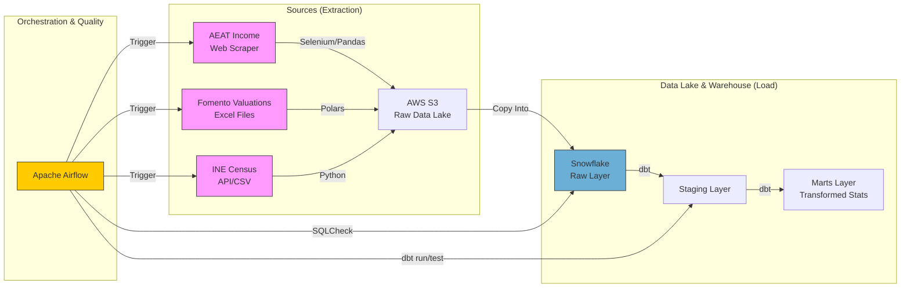

# 🇪🇸 Spain Housing Market Analysis Data Pipeline

[](https://airflow.apache.org/)
[](https://www.getdbt.com/)
[](https://www.snowflake.com/)
[](https://aws.amazon.com/s3/)
[](https://www.docker.com/)
[](https://www.python.org/)

An End-to-End **Advanced Data Engineering Project** that integrates widely dispersed government data sources to calculate the **Housing Affordability Tension Index** across Spanish municipalities.

This project demonstrates a production-grade ETL/ELT architecture using modern Data Stack tools to solve a real-world economic analysis problem.

---

## 🏗️ Architecture



---

## 🎯 Project Overview & Business Logic

### The Problem
Housing affordability is a critical issue in Spain. Data, however, is siloed:
*   **Income Data**: Hidden behind complex interactive portals (Tax Agency).
*   **Housing Prices**: Locked in unstructured Excel files from the Ministry of Development.
*   **Demographics**: Distinct datasets from the National Statistics Institute.

### The Solution: Tension Index
This pipeline unifies these sources to calculate the **Tension Index**:

$$ \text{Tension Index} = \frac{\text{Housing Price (€/m²)}}{\text{Avg. Disposable Income (€)}} \times 100 $$

*   **Metric**: Higher values (>10) indicate severe stress on affordability.

---

## ⚙️ Key Technical Features

### 1. Hybrid Data Ingestion (Extraction Strategy)
This project handles diverse data formats and sources requiring specific engineering approaches:
*   **AEAT (Tax Agency)**: **Selenium Web Scraper** to extract data from dynamic JS-rendered tables (bypassing blocking requests).
*   **Fomento (Housing)**: Automated processing of legacy **Excel (.xls)** files using Polars/Pandas logic.
*   **INE (Census)**: Integration of large **CSV** exports via direct download.

### 2. Modern Data Lake Architecture (S3 + Parquet)
*   **Raw Layer**: All ingested data is converted to **Parquet** format and stored in **AWS S3** for efficient, compressed, and schema-preserving storage.
*   **Staging Layer**: Raw Parquet files are loaded into **Snowflake** using the `COPY INTO` command.

### 3. Robust Transformation (dbt + Snowflake)
*   **Municipality Normalization**: Implemented complex SQL logic to align mismatched municipality names across sources (e.g., handling *"Coruña, A"* vs *"A Coruña"* vs *"Coruña (A)"*).
*   **Materialization strategy**: Used `view` for Staging and `table` for Marts for optimal performance/cost.

### 4. Data Quality & Governance (Defense in Depth)
A multi-layered approach to ensure data trust:
*   **Ingestion Layer**: `SQLCheckOperator` in Airflow immediately blocks negative prices or unlikely outliers (>50k €/m²).
*   **Transformation Layer**: **dbt tests** validate referential integrity, uniqueness keys, and acceptable value ranges.
*   **Docs**: Auto-generated dbt lineage documentation.

---

## 📊 Sample Insights (Results)

*Top 5 Municipalities by Housing Market Tension (Sample Output)*

| Rank | Municipality          | Province | Housing Price (€/m²) | Avg. Income (€) | **Tension Index** |
|------|-----------------------|----------|----------------------|-----------------|-------------------|
| 1    | Santa Eulalia del Río | Baleares | 6,120.8              | 29,782          | **20.55**         |
| 2    | Eivissa               | Baleares | 5,270.8              | 28,704          | **18.36**         |
| 3    | Calvià                | Baleares | 5,256.1              | 29,089          | **18.07**         |
| 4    | Marbella              | Málaga   | 4,301.8              | 25,912          | **16.60**         |
| 5    | Torremolinos          | Málaga   | 3,675.6              | 23,935          | **15.36**         |

*(Data from 2025 Real Execution)*

---

## 🛠️ Stack & Technologies

*   **Cloud Infrastructure**: AWS EC2 (Hosting), AWS S3 (Data Lake)
*   **Orchestration**: Apache Airflow (Dockerized on EC2)
*   **Compute/Transformation**: dbt Core + Snowflake (ELT pattern)
*   **Containerization**: Docker & Docker Compose
*   **Languages**: Python (3.10), SQL, Jinja
*   **Libraries**: Polars, Pandas, Selenium, Airflow-Providers

---

## 💻 Setup & Usage

### 0. ☁️ Cloud Deployment Note
*This project is designed to be deployed on a Cloud VM (e.g., **AWS EC2 c7i-flex.large**) to handle the memory requirements of Selenium and Airflow containers.*

### 1. Installation & Infrastructure
1.  **Clone the Repository**
    ```bash
    git clone https://github.com/your-username/spain-housing-data-pipeline.git
    cd spain-housing-data-pipeline
    ```

2.  **Environment Setup**
    Create a `.env` file in the root directory with your credentials:
    ```env
    AIRFLOW_UID=50000
    AWS_ACCESS_KEY_ID=your_key
    AWS_SECRET_ACCESS_KEY=your_secret
    SNOWFLAKE_ACCOUNT=your_account
    SNOWFLAKE_USER=your_user
    SNOWFLAKE_PASSWORD=your_password
    ```

3.  **Run with Docker**
    ```bash
    docker-compose up -d --build
    ```

4.  **Access Airflow UI**
    *   Go to `http://localhost:8080`
    *   Login: `airflow` / `airflow`

### 2. Pipeline Execution Order
Once Airflow is running, trigger the DAGs in the following order:

1.  **Ingestion Phase (Extract & Load)**
    *   Trigger `aeat_income_to_s3_raw_ingestion`
    *   Trigger `fomento_valuations_to_s3_raw_ingestion`
    *   Trigger `ine_population_to_s3_raw_ingestion`

2.  **Transformation Phase (Transform)**
    *   Trigger `dbt_transformation_dag` (Runs models, tests, and docs generation)

---

## 📂 Project Structure

```bash
├── dags/
│   ├── aeat_income_ingestion_dag.py    # Selenium Scraper (Web -> Parquet -> S3)
│   ├── fomento_valuations_dag.py       # Excel Processor (XLS -> Parquet -> S3)
│   ├── ine_population_ingestion_dag.py # CSV Processor (CSV -> Parquet -> S3)
│   └── dbt_transformation_dag.py       # dbt Runner & Docs Generator
├── dbt/
│   ├── models/
│   │   ├── staging/                    # Cleaning & Standardization
│   │   └── marts/                      # Business Logic & Joins
│   ├── tests/                          # Data Quality Tests
│   └── dbt_project.yml
├── docker-compose.yml                  # Airflow + Selenium Infrastructure
└── requirements.txt
```

---

## 👨‍💻 Author

**Victor** - Data Engineer  
[LinkedIn](https://linkedin.com/in/your-profile) | [Portfolio](https://your-portfolio.com)